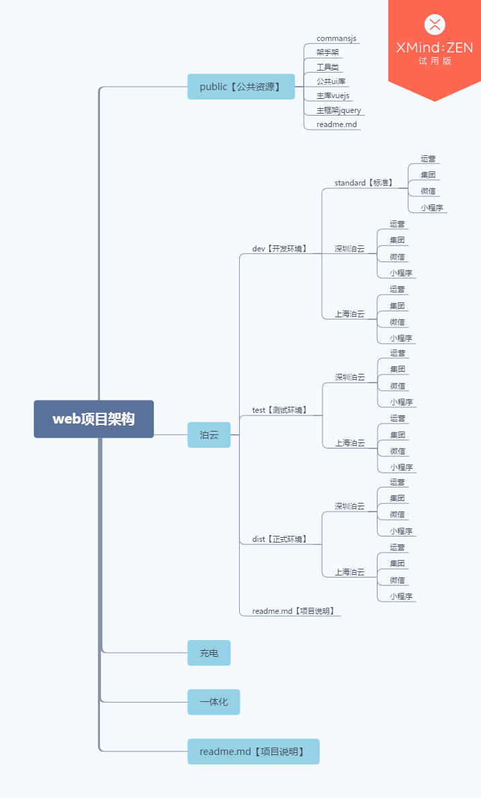

# 多城市多项目形态合并打包

## 项目结构

## 项目使用步骤

1. npm install -g ecaray-cli 全局安装
2. add wqb2017/vue-prejects-diff-merge 新增模板
3. init wqb2017/vue-prejects-diff-merge 初始化模板
4. cd my-project-name 进入模板
5. npm install 安装依赖
6. 启动对应的项目

> or

1. git clone https://github.com/wqb2017/vue-prejects-diff-merge.git
2. npm install 安装依赖

## 不同环境使用

* 启动开发环境
  npm run beijing

* 生成正式环境
  npm run beijingdist
